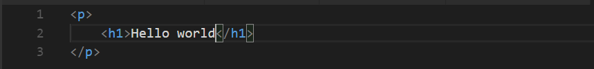
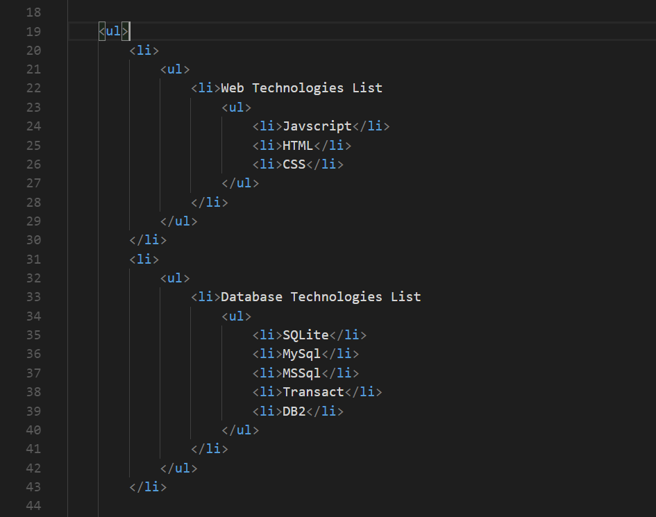

# What is HTML?
  HTML is markup language.  
  > HTML (Hypertext Markup Language) is the code that is used to structure a web page and its content. For example, content could be structured within a set of paragraphs, a list of bulleted points, or using images and data tables.  As the title suggests, this article will give you a basic understanding of HTML and its functions. 
  [Mozilla](https://developer.mozilla.org/en-US/docs/Learn/Getting_started_with_the_web/HTML_basics)

  
# Example of tags: Headings and paragraphs
  h1, h3 ... h6, p
  [Excercise](../coding-examples/html/example1.html)

# Pay attention to the syntax
  Pay attention to the syntyx
   
  Have a look at the closing and opening of each tag. We will do more example on this so it will be clear that the same sytax is followed everywhere.

# Tags (Elements)  
  | Tag             | Explanatory Name      | example          |
  |-----------------|-----------------------|------------------|
  | em              | emphisize             | <em> Banana </em>|
  | strong              | strong             | <strong> Banana </strong>|
  | bold              | bold             | <b> Banana </b>|
  | italic              | italic             | <i> Banana </i>|
  | s              | underline, incorrect             | <s> Banana </s>|
  | del, strike              | overline             | <del> Banana </del>|
  ...
  [Excercise](../coding-examples/html/example2.html)
    

# Nested Elements
  To make html more useful and powerful, we nest elements inside each other.
  
  [Excercise](../coding-examples/html/example3.html)

# Hierarchy / Categorization
  Nesting will turn our documents to structured documents just XML.

  
   
  What ? [XML ?](https://en.wikipedia.org/wiki/XML) 
  [Excercise](../coding-examples/html/example4.html)

# Multimedia 
  | Tag             | Explanatory Name      | example          |
  |-----------------|-----------------------|------------------|
  | img              | image             | <em> Banana </em>|
  | video              | video             | <strong> Banana </strong>|
  | audio              | audio             | <b> Banana </b>|
  | object              | object             | <i> Banana </i>|
  | s              | underline, incorrect             | <s> Banana </s>|
  | del, strike              | overline             | <del> Banana </del>|
  ...
  [Excercise](../coding-examples/html/example2.html)
  a, img, video, audio, object
  Excercise
# Navigation

# Tables
  table, tr, td, cols, thead, tbody
  
# Structure & Layouts
  div, article, section, footer, header, p, span

# How many tags are there?
  A good reference for finding a tag of your need is [w3schools](https://www.w3schools.com/tags/default.asp). They have an updated list of tags including their compatibility information. They also have live examples and demos for each tag which is a good way to test the tag before using it.

  But that is not the only reference available. Another great reference is 
  [Mozilla](https://developer.mozilla.org/en-US/docs/Web/HTML/Element)

# All HTML Tags
  [All HTML](https://www.labnol.org/tech/test-html-elements/20730/)

[Next](2.CSS.md)